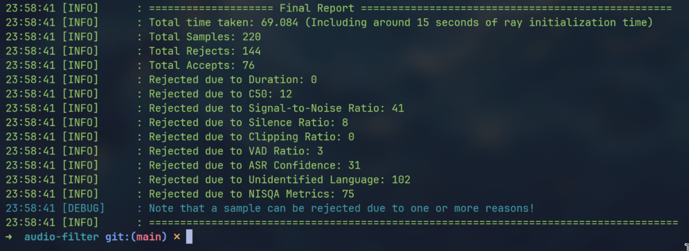
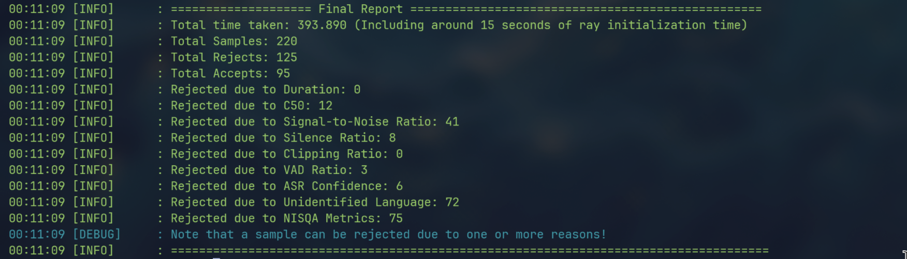

<div align="center">

# Audio Filtering Pipeline for Indic TTS Data

### Sarvam TTS Assignment Submission

**Submitted by:** Nakul Krishnakumar  
**Email:** nakulkrishnakumar@gmail.com  
**Profiles:** [LinkedIn](https://www.linkedin.com/in/nakul-krishnakumar-9aa951282/) | [GitHub](https://github.com/nakul-krishnakumar) | [Website](https://www.nakulkrishnakumar.live/)

</div>

---

## Table of Contents =------------w-dwpd-wdw[ TODO ]----------------------wdawdawdawd

- [Audio Filtering Pipeline for Indic TTS Data](#audio-filtering-pipeline-for-indic-tts-data)
		- [Sarvam TTS Assignment Submission](#sarvam-tts-assignment-submission)
	- [Table of Contents](#table-of-contents)
	- [Project Overview](#project-overview)
	- [Setup and Installation](#setup-and-installation)
		- [Prerequisites](#prerequisites)
		- [Hardware used](#hardware-used)
		- [Install dependencies](#install-dependencies)
		- [Hugging Face authentication](#hugging-face-authentication)
		- [Download Sample Audios (Optional)](#download-sample-audios-optional)
	- [How to Run](#how-to-run)
		- [Option A: one command (head + pipeline)](#option-a-one-command-head--pipeline)
		- [Option B: explicit Ray start and run](#option-b-explicit-ray-start-and-run)
		- [Add Ray Worker nodes (Optional)](#add-ray-worker-nodes-optional)
		- [Stop Ray runtime](#stop-ray-runtime)
		- [Open Reviewer Dashboard](#open-reviewer-dashboard)
	- [System Architecture](#system-architecture)
		- [High-level stages](#high-level-stages)
	- [Metrics Used](#metrics-used)
	- [Design Choices and Trade-offs](#design-choices-and-trade-offs)
		- [Whisper tiny usage](#whisper-tiny-usage)
	- [Results Snapshot](#results-snapshot)
		- [Whisper Tiny model report](#whisper-tiny-model-report)
		- [Whisper Medium model report](#whisper-medium-model-report)
		- [Observation: Gujarati false rejection example](#observation-gujarati-false-rejection-example)
		- [Tiny vs Medium vs Large-v2 note](#tiny-vs-medium-vs-large-v2-note)
	- [Human-in-the-Loop Review Dashboard](#human-in-the-loop-review-dashboard)
		- [Features](#features)
		- [Run dashboard](#run-dashboard)
		- [Why this matters](#why-this-matters)
	- [Input and Output Data Format](#input-and-output-data-format)
		- [Input manifest](#input-manifest)
		- [Output manifest](#output-manifest)
	- [How to Extend the Pipeline](#how-to-extend-the-pipeline)
		- [Plug another dataset](#plug-another-dataset)
		- [Scale to larger workloads](#scale-to-larger-workloads)
	- [Design Decisions and Engineering Notes](#design-decisions-and-engineering-notes)
	- [Limitations and Future Improvements](#limitations-and-future-improvements)
	- [Reproducibility Notes](#reproducibility-notes)
	- [Documentation Quality Checklist](#documentation-quality-checklist)
	- [References](#references)

---

## Project Overview

This project builds a **rule-based audio filtering pipeline** to curate high-quality multilingual speech samples for Text-to-Speech (TTS) workflows.

It processes IndicVoices data, computes quality and intelligibility metrics, applies filtering rules, and writes a final `filtered_manifest.jsonl` with:

- per-sample metrics,
- accept/reject decisions,
- rejection reasons.

---

## Setup and Installation

### Prerequisites

- Python `>= 3.11`
- `uv` package manager ([installation](https://docs.astral.sh/uv/getting-started/installation/))

### Hardware used

- GPU: RTX 4060 (8 GB VRAM)
- RAM: 16 GB

### Install dependencies

```bash
make install
```

This runs:

- `uv sync`

### Hugging Face authentication

Required for `pyannote/brouhaha` with gated access.

>[!NOTE]
> I have added a personal fine-grained token with gated access support in this pipeline so it should work, if it doesn't, please do the following and login with a token with respective access.

```bash
uv run hf auth login
```

You can also provide token by pasting it in `.env`:

```bash
HF_TOKEN="<fine-grained-token>"
```

### Download Sample Audios (Optional)

I have added the test sample audios along with the submission, if it doesn't exist or not usable, run the following:
```bash
make download
```


---

## How to Run

### Option A: one command (head + pipeline)

```bash
make run_head
```

### Option B: explicit Ray start and run

```bash
make start_head
make run
```
It starts the Ray runtime as head node.</br>
You can monitor Ray runtime and resources by going to `http://127.0.0.1:8265/`

### Add Ray Worker nodes (Optional)
Additional resources can be easily added to the runtime by deploying Ray worker nodes.
To do that, simply clone the project in another device, install dependencies and then from project base directory run:
```bash
make run_worker ADDR=<HEAD_NODE_IP> PORT=<HEAD_NODE_PORT>
```

Make sure the port is not behind firewall in the host device, if it is, then allow traffic by doing the following:
```bash
sudo ufw allow <HEAD_NODE_PORT>
sudo ufw reload
```

`<HEAD_NODE_PORT>` is usually by default port `6379`.


### Stop Ray runtime

```bash
make stop
```

### Open Reviewer Dashboard

```bash
make dashboard
```
Dashboard opens at `http://127.0.0.1:5000`

Current default input and output:

- Input: `input/test_manifest.jsonl`
- Output: `output/filtered_manifest.jsonl`

---

## System Architecture

The pipeline follows a distributed architecture revolving around the Ray framework. The main part is the Ray Cluster with all the resource pool that each Task or Actor depends upon. The program flow is as follows:</br>
1. The raw IndicVoice corpus is ingested and streamed batch by batch using pytorch `IterableDataset` after canonicalizing them to single-channel 16kHz (format most models prefer). This makes sure that the entire dataset is not loaded onto the memory at once, ensuring **reduced memory consumption**.
2. Each sample in a batch is assigned to an independent **Ray Task** which is a stateless worker that runs the soft filters (low consumption) on the same.  
3. After all the samples in the batch are processed, they are then passed to **Ray Actors** which are stateful workers that runs the hard filters. They will retain memory and this helps us to reuse the same model instance acrossed batches instead of initializing it repeatedly for each batch.
4. Then all the metrics are aggregated and passed to Rule engine which decides whether to pass the audio or not. Outputs are then written onto a `.jsonl` file.
5. Then the next batch starts the loop.
6. The final output can be then reviewed through the reviewer dashboard (run `make dashboard`)

Architecture Diagram:


---

## Metrics Used

- All metrics are implemented in `src/pipeline/filterer.py`.

---

1. **Duration**
- This function helps us find if the audio duration is between `0.2 to 30 seconds`.
- Reason for threshold: An already proved production grade filtering pipeline [IndicVoices-R](https://arxiv.org/html/2409.05356#:~:text=Audio%20We,data) mentions that audios should be between this time duration.

---

2. **C50**
- This function helps us identify how much of the sound energy in that audio arrives before 50ms or after 50ms from the start of the speech.
- **High** => Good
- **Low** => Bad (Echo or reverberation)
- Reason for usage:
  - It is better to avoid highly reverbed or echoing audio to maintain speech clarity throughout the samples.
- An already proved production grade filtering pipeline [IndicVoices-R](https://arxiv.org/html/2409.05356#:~:text=Audio%20We,data) uses `30dB` as the threshold.
- In the above reference, C50 is predicted using `brouhaha` model, and I have followed the same in this pipeline.

---

3. **SNR (Signal-to-Noise Ratio)**
- This function measures how much speech signal energy is present compared to background noise energy in the audio.
- **High** => Good (clean speech, low noise)
- **Low** => Bad (noisy, hard to understand)   
- Reason for usage:
	- It helps filter out audio with:
		- background chatter
		- traffic noise
		- fan / wind noise
		- recording artifacts
	- Low SNR audio can:
		- confuse ASR models
		- degrade embeddings
		- reduce overall dataset quality
- An already proved production grade filtering pipeline [IndicVoices-R](https://arxiv.org/html/2409.05356#:~:text=Audio%20We,data) uses `25dB` as the threshold.
- In the above reference, SNR is predicted using `brouhaha` model, and I have followed the same in this pipeline.

---

4. **Silence Ratio**
- This function measures the fraction of the audio that contains silence or near-silence.
- **Low** => Good (more useful speech content)
- **High** => Bad (too much empty / non-informative audio)
- Reason for usage:
  - Helps remove audio with:
	- long pauses before/after speech
	- gaps between words/sentences
	- recordings where the speaker barely talks
  - High silence ratio leads to:
	- low information density
	- inefficient training (wasted compute on silence)
- Threshold was choosen in such a way that if the audio has more than 50% silence (0.5), then discard it.

---

5. **Clipping Ratio**
- This function measures the fraction of audio samples whose amplitude exceeds the maximum representable range and gets “cut off”.
- **Low** => Good (undistorted signal)
- **High** => Bad (distorted / saturated audio)
- Reason for usage:
  - Helps detect audio with:
	- microphone saturation
	- overly loud recordings
	- improper gain settings
  - Clipping causes:
	- loss of waveform information which cant be restored
	- harsh, distorted sound
- The threshold is chosen such that if more than 10% of the samples are clipped (>= 0.1), the audio is discarded, ensuring minimal distortion in the dataset.
- A sample is clipped when its amplitude exceeds 98% of max amplitude.

---

6. **VAD Ratio (Voice Activity Detection)**
- This function measures the fraction of the audio that contains speech.
- **High** => Good (more speech content)
- **Low** => Bad (less speech, more silence/noise)
- Reason for usage:
  - It ensures the audio has real speech and not silence or random noise.
  - Complements silence_ratio by explicitly verifying presence of speech, not just absence of silence
- It is computed using `brouhaha` model.
- Threshold was chosen heuristically.

---

7. **ASR Confidence (Whisper avg logprob)**
- This function measures the average log probability of the transcribed tokens from an ASR model (here we use `whisper`), used to find transcription confidence.
- **High** ⇒ Good (model is confident about the transcription)
- **Low** ⇒ Bad (uncertain / poor-quality audio)
- Reason for usage:
  - Helps filter out audio with:
	- unclear pronunciation
	- heavy noise or distortion
	- mismatched or unintelligible speech
  - Low ASR confidence indicates:
	- poor intelligibility
	- unreliable transcripts
	- potential labeling errors
- Threshold was chosen heuristically. I knowingly kept the threshold low to be a bit more lenient with filtering.
- `whisper` was not trained on 8 specific languages which are available in `IndicVoice` dataset, so for those languages, I ignored ASR confidence.
- The `IndicConformer-600m-multilingual` model could have been used to compute `WER` and `CER` instead, but this was not feasible due to resource constraints. It also supports the other 8 langs that `whisper` doesnt.

---

8. **LID (Language Identification)**
- This function checks whether the predicted language of the audio matches the expected/annotated language.
- Reason for usage:
	- Helps ensure dataset correctness and consistency
	- Filters out:
		- mislabeled samples
		- code-mixed or unexpected language segments
		- noisy predictions due to poor audio quality
- `whisper` was not trained on 8 specific languages which are available in `IndicVoice` dataset, so for those languages, I ignored LID prediction.
- There was also a case where a very clear Gujarati Audio (**0.957 ASR Confidence**) was rejected due to `whisper` misinterpreting it as Hindi.
  
	<audio controls>
	<source src="data/audios/gujarati/valid-00000-of-00001/3377699720681139_chunk_1.flac" type="audio/flac">
	Go here: data/audios/gujarati/valid-00000-of-00001/3377699720681139_chunk_1.flac
	</audio>
- I found this case while reviewing the filtered output through the reviewer dashboard (run `make dashboard`)
- Another case was were the speaker was using english words (**code-mixing**) and the model predicted it as english.
- Cases like these show that even though models are very good at what they do, a human-in-the-loop setup will always be benefitial to catch edge cases.

---

9. **NISQA MOS (Perceptual Quality Score)**
- This function predicts the Mean Opinion Score (MOS) of the audio using a deep learning model (NISQA), approximating human perception of quality.
- **High** => Good (sounds natural and clean)
- **Low** => Bad (perceptually poor audio)
- Reason for usage:
	- Captures perceptual quality aspects not covered by signal-based metrics, such as:
		- unnatural sound
		- compression artifacts
		- distortions not reflected in SNR/C50
	- Helps filter out audio that:
	- technically passes all checks
	- but still sounds bad to humans
- [IndicVoices-R](https://arxiv.org/html/2409.05356#:~:text=Audio%20We,data) uses NORESQA-MOS and random samples from LibriTTS, but I could not set it up due to dependency conflicts with other models.
- The sample passes NISQA gate if at least **4 out of 5** perceptual metrics pass their minimum thresholds.
This was done to make the filtering a bit lenient.
- For thresholds I refered [ankandrew/nisqa-v2.0](https://huggingface.co/spaces/ankandrew/nisqa-v2.0)
- I kept the threshold lower from what is used in the above reference so as to be more lenient with filtering (as I am using around 10 filters in total).

---

The active decision thresholds are from `thresholds.json`.

```json
{
	"min_duration": 0.2,
	"max_duration": 30.0,
	"min_c50": 30.0,
	"min_snr": 25.0,
	"max_silence_ratio": 0.5,
	"min_vad_ratio": 0.4,
	"min_asr_conf": 0.25,
	"max_clipping_ratio": 0.1,
	"min_mos": 2.8,
	"min_noisiness": 2.3,
	"min_discontinuity": 2.1,
	"min_coloration": 2.3,
	"min_loudness": 2.3
}
```

---

## Design Decisions, Trade-offs and Engineering Notes

### Whisper tiny usage

- Whisper tiny was chosen for simplicity and resource constraints, with known limitations for Indic language coverage.
- If resources available, I would use `IndicConformer-600m-multilingual` for `WER` and `CER` calculation and `IndicLID` for language detection.

- Whisper does not support the following languages:

	- `brx` (Bodo)
	- `doi` (Dogri)
	- `ks` (Kashmiri)
	- `kok` (Konkani)
	- `mai` (Maithili)
	- `mni` (Manipuri)
	- `sat` (Santali)
	- `or` (Odia)

For these languages, ASR/LID checks are skipped to reduce false penalties.

### Why streaming dataset loading?

Streaming-style iteration over manifest lines reduces peak memory usage and scales better for large multilingual corpora.

### Why Ray actor for hard filters?

Hard filters load heavy models. Using a Ray actor keeps model state warm across batches and avoids repeated initialization overhead.

### Why soft filters as Ray tasks?

Soft metrics are lightweight and stateless, so task-level fanout is sufficient.

### Why Ray?

- My initial plan was to go with a publisher-subscriber model using kafka or any other message broker.
- But then realised that ray did this job very well internally and reduces complexity.
- Ray can scale very well both in parallel as well as distributed setups.
- To scale parallely, we could add more Ray Tasks and Actors.
- To scale distributively, we can add more worker nodes to the Ray cluster, increasing resource pools.
- I tested Ray cluster connectivity by connecting to my head node from another laptop.

### Why not Dockerize?

Pipeline was not dockerized for this submission. Containerizing distributed Ray workflows is possible, but requires careful handling of networking and port mapping across head/worker nodes, so I avoided it for the time being.

---

## Results Snapshot

### Whisper Tiny model report (batch size = 5)



### Whisper Medium model report (batch size = 5)



### Observation: Gujarati false rejection example

A clear Gujarati clip with high ASR confidence (`~0.957`) was rejected because predicted language was Hindi and C50 was below threshold.

This failure mode motivates stronger Indic-specific LID/ASR.

### Tiny vs Medium vs Large-v2 note

- Tiny and Medium visual results are included above.
- Large-v2 was not run in this submission due to resource/time constraints.
- Expected trend: better multilingual robustness with larger models, at the cost of latency and memory.

---

## Human-in-the-Loop Review Dashboard

Current implementation is in Flask + server-side rendered HTML/JS (`dashboard/app.py`).

### Features

- Paginated sample browser with inline audio playback.
- Sort by key metrics (duration, ASR, MOS, SNR, C50, etc.).
- Boundary-based filtering around thresholds.
- Manual status edits (`Accept` / `Reject`) and persistent save back to manifest.

### Run dashboard

```bash
make dashboard
```

Then open `http://localhost:5000`.


### Why this matters

Automated decisions can be misinterpreted. Human review allows rescuing borderline or misclassified samples before final training set freeze.

---

## Input and Output Data Format

### Input manifest

Expected JSONL fields (minimum):

- `audio_filepath`
- `duration`
- `lang`

Example source: `input/test_manifest.jsonl`

### Output manifest

Generated fields include:

- `audio_filepath`
- soft metrics: `duration`, `clipping_ratio`, `silence_ratio`
- hard metrics: `asr`, `mos`, `noisiness`, `discontinuity`, `coloration`, `loudness`, `pred_lang`, `expected_lang`, `vad_ratio`, `snr`, `c50`
- decisions: `status`, `reject_due_to`

Example output file: `output/filtered_manifest.jsonl`

```json
{"audio_filepath": "/home/nakul/devfiles/PROJECTS/audio-filter/data/audios/bengali/valid-00000-of-00001/1407374883619853_chunk_6.flac", "duration": 8.704, "clipping_ratio": 0.0, "silence_ratio": 0.07352941483259201, "asr": 0.9485736390894858, "mos": 2.9333860874176025, "noisiness": 2.990189790725708, "discontinuity": 4.400715351104736, "coloration": 3.8577053546905518, "loudness": 4.275895118713379, "pred_lang": "bn", "expected_lang": "bn", "vad_ratio": 0.9961240310077519, "snr": 44.512290954589844, "c50": 54.885292053222656, "status": "Accept", "reject_due_to": []}
```

---

## How to Extend the Pipeline

### Plug another dataset

1. Produce JSONL manifest with `audio_filepath`, `duration`, `lang` (and optional fields).
2. Point `manifest_path` in `main.py` or directly in `run_pipeline(...)`.
3. Ensure language tags are compatible with expected ISO format (`src/utils/iso_mapping.py` can be extended).
4. Run pipeline and validate output schema.

### Scale to larger workloads

- Start Ray head + workers across multiple machines (`make start_head`, `make start_worker`).
- Tune `batch_size` and DataLoader workers.
- Monitor with Ray dashboard.

---

## Limitations and Future Improvements

1. Replace Whisper tiny with stronger Indic-capable ASR + explicit WER/CER.
2. Replace LID proxy with dedicated Indic LID model.
3. Replace NISQA-MOS with NORESQA-MOS.

---

- As part of the some research work I did for this project, I found a type in the `torchmetrics` repo and opened a PR for it. [PR](https://github.com/Lightning-AI/torchmetrics/pull/3357)

## References
- https://github.com/NVIDIA/NeMo-speech-data-processor/blob/main/sdp/processors/tts/metrics.py
- https://huggingface.co/spaces/ankandrew/nisqa-v2.0/blob/main/app.py
- [IndicVoices-R](https://arxiv.org/html/2409.05356)
- https://huggingface.co/pyannote/brouhaha


---
<h3 align="center">Thank you </h3>