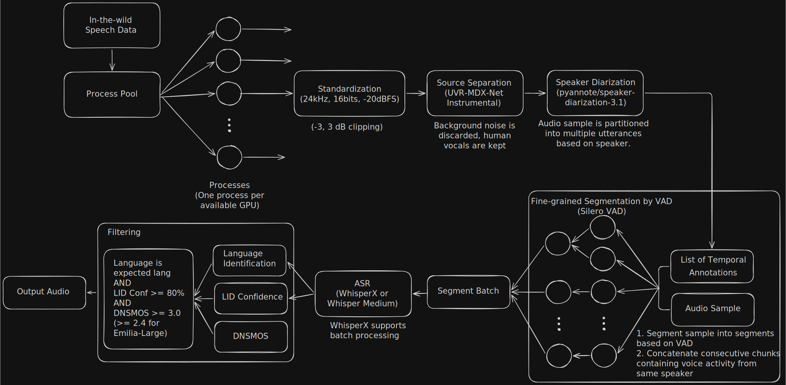
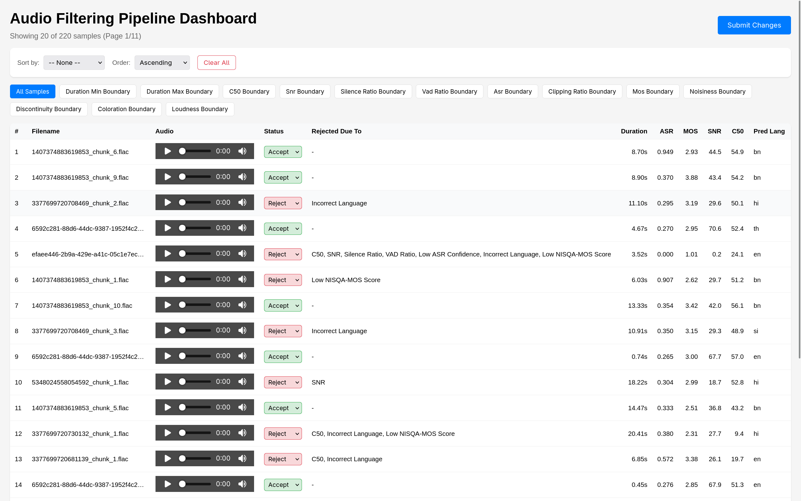
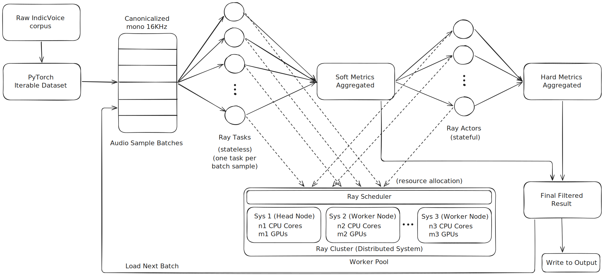

<div align="center"> 

# Emilia Pipeline Study Report

</div>

## 1. Understanding of the Emilia Pipeline

Emilia-Pipe is an open-source preprocessing pipeline designed to transform raw, **in-the-wild** speech data into high-quality training data for speech generation models. It processes multilingual speech data in (En, Zh, De, Fr, Ja, Ko), and produced over 216k hours of training data in Emilia-Large.

- Specifically for audio samples in the language **English, Chinese, German, French, Japanese and Korean** 

- Their main source of data was **in-the-wild** speech samples sourced from a vast collection of video and podcast platforms on the Internet.

- The challenges of using **in-the-wild** data are:
  - frequent background noise or music
  - reverberation
  - overlapping speakers within a single sample
  - inconsistent speech lengths
  - absence of essential annotations.

- Using this preprocessing pipeline they produced two datasets:
  - **Emilia** - 101k hours
  - **Emilia Large** - 216k hours

---

## 2. Key Components in Speech Data Processing

- Key components are:
  - **Audio standardization** (bit depth, sampling rate)
  - **Pre-processing** (noise reduction, VAD, normalization, segmentation by diarization)
  - **Speech Recognition** (ASR confidence, WER, CER)
  - **Filtering** (DNSMOS, LID Confidence, SNR)
  - **Post Processing** (Punctuation & Text Formating, Gender Identification, Other metadata generation)



The pipeline consists of six sequential stages:

| Stage | Purpose | Key Technology |
|-------|---------|----------------|
| Standardization | Standardize and normalize audio format | WAV, mono, kHz, -20dBFS (±3dB), [-1,1] normalization |
| Source Separation | Remove background music/noise | UVR-MDX-Net Inst |
| Speaker Diarization | Partition by speaker |  `pyannote/speaker-diarization-3.1` |
| Fine-grained Segmentation | Segment to 3-30s | Silero-VAD |
| ASR | Transcribe speech | WhisperX (faster-whisper + CTranslate2, 4x faster) |
| Filtering | Quality control | DNSMOS ≥3.0, lang confidence ≥80% |

**Processing efficiency**: ~0.006 RTF (666.94 hours in 240.5 mins on 8x RTX 4090)

---

## 3. Scaling to Large Datasets

- Incorporate Distributive approaches to make it horizontally scalable.
- Distributive architecture will make it more fault tolerant, current the system has a single point of failure.
- Add proper dataset sharding.
- Batch load audios into memory instead of either loading it one by one or loading all audio all together.


---

## 4. Suggested New Components

### Early Cheap Pre-filter (Before Heavy Processing)

- Simple energy-based filter before source separation
- Discard obviously silent, music-only, or ultra-noisy segments early
- Reduces computation on irrelevant data
- Example
  - SNR and a minimum duration filter

### Synthetic Speech / Deepfake Detector
- Detect TTS/voice-conversion audio in training data
- Prevents bias from synthetic speech increasingly present in web data
- Critical for building authentic speech generation models

### Human-in-the-Loop Review System
- **Reviewer Dashboard** for boundary case evaluation
- Not feasible to check each sample, but focus on:
  - Near-margin samples (DNSMOS 2.5-3.5)
  - Low confidence ASR outputs
  - Speaker overlap flagged segments
- Implemented this in my assignment, added near boundary check filters.



---

## 5. Optimization & Parallelization Approaches


1. **Batch audio loading to reduce I/O overhead**
   <br>This reduces repeated read overhead and helps keep the CPU and GPU better utilized. 
   <br>Also the model used for source separation (UVR MDX Net Inst) supports batch processing but we do not utilize it. This can be utilized by batching audio samples.

1. **Separate preprocessing from filtering**
   <br>The current approach appears to batch processing around VAD segments, which can become inefficient when many files contain few or no useful segments. To scale better, preprocessing should be split into distinct stages: first detect and segment speech, then filter and score those segments independently. This allows each stage to be optimized separately and prevents the entire pipeline from waiting on a slow or sparse input file.

2. **Move from vertical scaling to horizontal scaling**
   <br>A single-machine design can only scale up to a point. For millions of hours of data, the pipeline should be able to scale across multiple machines in a distributed cluster. This would improve throughput and also make the system more fault tolerant: if one worker fails, only a portion of the workload is affected instead of the entire pipeline.
   <br>**Implemented this in my assignment using Ray Cluster.**

3. **Introduce proper data sharding and worker partitioning**
   <br>For large-scale processing, each worker must receive a unique shard of the dataset. Without explicit sharding, multiple workers may end up processing the same input path, wasting compute and creating redundant work. A proper distributed design should divide the dataset into non-overlapping chunks so that workers operate independently and efficiently.

4. **Add an early filtering gate using VAD and quality heuristics**
   <br>Before running expensive ASR or downstream filtering, the pipeline should use a lightweight front-end gate such as VAD, silence ratio checks, and basic audio-quality heuristics. This reduces unnecessary computation on empty, silent, or obviously low-quality inputs. Such early rejection is especially valuable at scale because even small savings per file add up significantly over millions of hours.

5. **Distributed fault tolerance**

6. **Support language-specific adaptation in the filtering stack**
   <br>If the target data includes multilingual or Indic speech, the ASR and evaluation components should be adapted accordingly. A scalable pipeline should not assume one fixed language set or one universal normalization strategy. Language-aware processing improves data quality and prevents unnecessary rejection of valid samples.

### 5.2 Proposed Improvements

**I/O Optimization (Batch Loading)**:
```
Current:  CPU → Load → Process → Save → CPU → Load → Process → Save
          [    audio1    ] [    audio2    ] [    audio3    ]

Proposed: CPU → Load batch → Process batch → Save batch → CPU
          [ audio1 | audio2 | audio3 | audio4 ]
```


---

## Comparison with my Assignment



---

## Learnings And Outcomes

- In my assignment, I rejected a sample if its SNR ratio or VAD ratio went below threshold, but did not consider the fact that the sample can be segmented and good segments can be used.
- Real World data is not ready for use and requires heavy preprocessing.

---